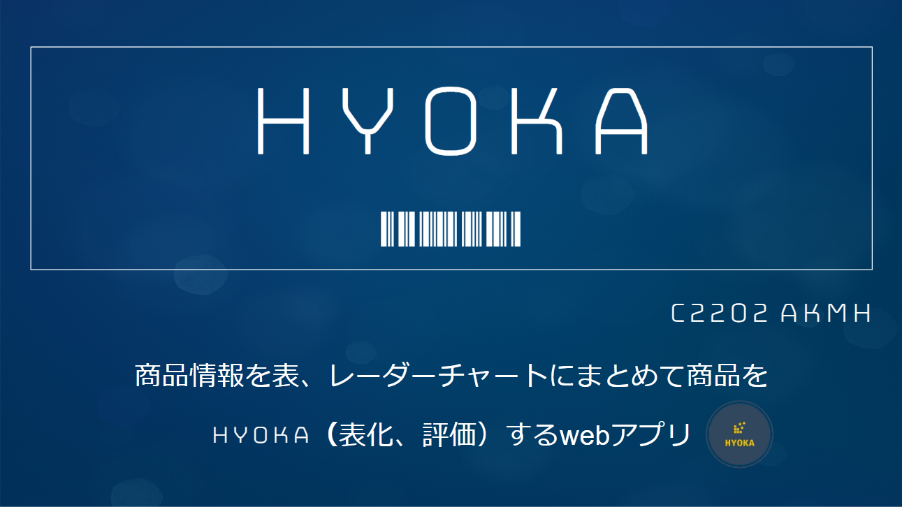

# HYOKA

## 製品概要

amazon の商品リンクを入力することで、商品情報を表、レーダーチャートにまとめて商品を「表化」し、「評価」するための web アプリです

### 背景(製品開発のきっかけ、課題等）

人がショッピングをするときは必ず、複数の商品を「比較する」という行為を行うと思います. 例えば炊飯器を購入しようとする際には、炊飯器のメーカー、値段、見た目、合数、サイズなどを比較するでしょう. これらの複数のパラメータを脳内でまとめる、もしくはスプレッドシートなどを作成してまとめるのは面倒です. そこで私たちは自動で商品情報を表にまとめ、レーダーチャートを作成するツールを作成し、日頃行うショッピングの手助けをしようと考えました.

### 製品説明（具体的な製品の説明）

### 特長

#### 1. 特長 1

Amazon の URL を入力すると、データが自動的に表に変換される. また表を自由にソート、色付けできる.

#### 2. 特長 2

データをレーダーチャートとして表示し、誰でも判りやすく比較することが出来る

#### 3. 特長 3

表を CSV として保存、また CSV を表に表示することが出来る.

### 解決出来ること

ネットショッピングでの、「あ、こっちの方が良かったのに」という体験を無くす。
また、ショッピングの際、どの商品を買うべきか悩む時間の削減。

### 今後の展望

- 一部不親切な UI の改善
- Amazon 以外のサイトとも比較できるようにする

### 注力したこと（こだわり等）

- ユーザーができるだけ作業しなくていいように、データ整形を自動的に行うようにした.
- ユーザーが自分好みに表をカスタマイズできるように、列の並べ替え、統合、セルの色付けをできるようにした
- 作成した表を使いまわせるように CSV に変換し、その CSV を読み込むことで再び同じデータの入った表を作成できるようにした

## 開発技術

### 活用した技術

#### フレームワーク・ライブラリ・モジュール

- React
- FasaAPI
- selenium & beautifulsoup4

#### デバイス

- PC

### 独自技術

#### ハッカソンで開発した独自機能・技術

- 独自で開発したものの内容をこちらに記載してください
- 特に力を入れた部分をファイルリンク、または commit_id を記載してください。
